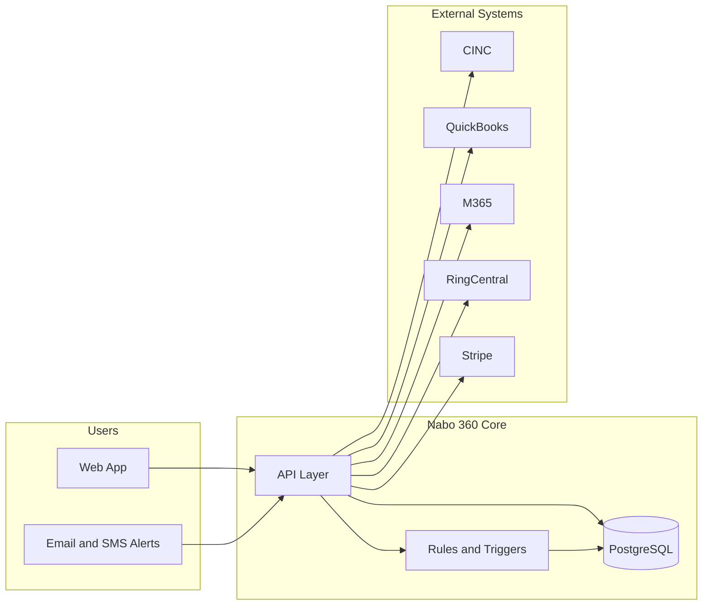

# Nabo 360 — Development Overview for CEO

This document is a technical execution plan for building **Nabo 360** from scratch. It is based on the system requirements in [Specifications/](Specifications/) (Master Matrix, Compliance Module, Executive Dashboard, and Insurance Intelligence) and is written so a CEO can understand scope, approach, timeline, and risk without needing deep technical knowledge.

---

## 1. Development Approach & Starting Point

**How to start**

- **Begin with the data model, not the UI.** The [Master Matrix](Specifications/MasterMatrix.txt) defines four universal IDs (Community ID, Corporate ID, Unit ID, Vendor ID) that every module must use. Lock these in first so Accounting, Compliance, Insurance, Contracts, Board Reporting, and Maintenance stay aligned from day one.
- **Build one vertical slice first.** Choose a single module (recommended: **Compliance** or **Insurance**) and deliver it end-to-end: database, business logic, API, basic UI, and one or two key automations. That proves the architecture and gives early business value.
- **Treat the Match Matrix as the contract between modules.** Any new feature that touches multiple areas (e.g., “vendor payment” touches Maintenance, AP, and Compliance) must be designed so data flows via these IDs and trigger rules are explicit.

**Key architectural decisions to make early**

| Decision                | Options                                   | Recommendation                                                                                                                                                                                                                                                               |
| ----------------------- | ----------------------------------------- | ---------------------------------------------------------------------------------------------------------------------------------------------------------------------------------------------------------------------------------------------------------------------------- |
| **Database**            | PostgreSQL vs. other relational DBs       | **PostgreSQL** — specs call out strong relational cross-linking; fits the matrix model.                                                                                                                                                                                      |
| **Build vs. configure** | Custom app vs. Airtable/no-code heavy     | **Custom application** with a relational DB — Insurance was scoped as “Airtable-based” in email; Master Matrix recommends API-driven connectors and a single source of truth. A custom core with integrations (CINC, Stripe, etc.) scales better and keeps one Match Matrix. |
| **Integrations**        | Which systems are “source of truth”       | Decide early: CINC for communities/associations, QuickBooks (or equivalent) for GL/AP, and Nabo 360 as the orchestration and compliance/insurance/executive layer. Document which system owns Community ID, Vendor ID, etc.                                                  |
| **AI/automation**       | When to introduce AI scoring and triggers | **Phase 2.** MVP uses rules (e.g., “alert at 90/60/30 days”). Add AI for proposal scoring, fatigue prediction, and “if X then Y” meta-triggers once core data and workflows are stable.                                                                                      |

**Recommended methodology**

- **Phased delivery with an MVP-first mindset.** Each phase ends with a deployable slice that delivers value (e.g., compliance calendar and alerts, then insurance renewal tracker, then executive dashboard).
- **Short cycles (e.g., 2-week sprints)** with demos at the end of each so the business can steer and reprioritize.
- **Document trigger points and data flows** as you build (using the Master Matrix as the template) so new developers or future modules stay consistent.

---

## 2. Prerequisites & Setup Requirements

**Technical prerequisites**

- **Tech stack (recommended):**
  - Backend: API service (e.g., Node.js, .NET, or Python) with clear REST or GraphQL APIs.
  - Database: PostgreSQL (hosted e.g. on AWS RDS, Azure, or similar).
  - Frontend: Modern web stack (e.g., React/Vue) for dashboards and “Flag Center” style views; responsive for mobile-friendly alerts.
  - Hosting: Cloud (e.g., AWS, Azure, GCP) with staging and production environments.
- **Integrations to plan for:**
  - **CINC** — community/association data (and possibly renewal/agent data if API allows).
  - **Vantaca** — if used for operations.
  - **Stripe and/or QuickBooks** — payments and GL/AP.
  - **Microsoft 365 (and optionally Teams)** — for Executive Dashboard email/fatigue metrics.
  - **RingCentral** — for call/usage data in fatigue and utilization.
  - **Twilio (or similar)** — SMS alerts (compliance, insurance, executive).
  - **DocuSign** — enrollment/signatures (e.g., agent enrollment in Insurance).
- **Accounts and access:** CINC API credentials, M365 and RingCentral API access, Stripe and QuickBooks (or equivalent) sandbox and production, domain and SSL for the app, and a way to send transactional email (e.g., SendGrid, SES).
- **CI/CD:** Automated tests and deploy pipeline (e.g., GitHub Actions, Azure DevOps) from repo to staging, with manual or gated promotion to production.
- **Environments:** At least **development**, **staging**, and **production**; staging used for integration testing and UAT.

**Non-technical prerequisites**

- **Business rules clarity:** Which states and entity types (HOA, condo, etc.) are in scope first; exact alert thresholds (e.g., 90/60/30 days for filings); fee rules for insurance agents (e.g., 5% of premium, 20/80 split) and approval workflows.
- **User roles:** Define who can see what (e.g., community managers vs. executives vs. accounting) and what actions require approval (e.g., management certificate filings, agent approval).
- **Data ownership and compliance:** Who owns community vs. corporate data; any regulatory or insurance-specific compliance (e.g., handling of E&O, COI, financial data); retention and audit trail requirements.
- **Security and compliance:** Access control, audit logging (“who approved, posted, corrected”), secure storage of documents (permits, licenses, policies), and if applicable SOC2 or similar later.

---

## 3. System Architecture Overview

**High-level architecture**

- **Frontend:** Web application for dashboards (per Community ID, per executive view), Flag Center (upcoming compliance/accounting/insurance events), and module-specific screens (compliance calendar, insurance renewals, agent CRM, executive tiles).
- **Backend:** API service that enforces business rules, runs scheduled jobs (alerts, renewals), and implements “trigger points” from the Master Matrix (e.g., “Insurance policy bound → notify Accounting and Board Reporting”).
- **Database:** PostgreSQL with normalized tables around Community ID, Corporate ID, Unit ID, Vendor ID; document storage (e.g., S3 or equivalent) for certificates, policies, and filings.
- **Integrations:** API-driven connectors to CINC, Vantaca, QuickBooks, Stripe, M365, RingCentral, Twilio, DocuSign, and optionally resale platforms (e.g., HomewiseDocs).
- **Automation:** Scheduled jobs and event-driven logic for alerts (email + SMS), renewal reminders, and escalation; later, an AI/ML layer for scoring and predictive alerts.

**Data flow in simple terms**

- **One place for identity:** Every community, vendor, corporate entity, and unit is identified by a stable ID in Nabo 360 (and synced from or to CINC where appropriate).
- **Events drive actions:** When something happens (e.g., “compliance due in 30 days,” “insurance renewed,” “vendor invoice paid”), the system checks trigger rules and updates other modules or sends alerts. For example: vendor payment → COI check (Compliance) → post payment (Accounting).
- **Documents and state live in Nabo 360:** Permits, licenses, certificates, and policy metadata are stored and linked to the correct ID so all modules see one version of the truth.

**Scalability and maintainability**

- **Database:** Normalized schema and indexes on the four universal IDs and key dates (renewal, due date) so reporting and alerts stay fast as data grows.
- **APIs:** Clear module boundaries (compliance, insurance, accounting, executive) so teams can work in parallel and integrations can be swapped (e.g., different accounting system) with minimal impact.
- **Config over code:** Alert windows (90/60/30), fee percentages, and state-specific rules should be configurable (e.g., in DB or config) so the business can change them without full releases.
- **Audit trail:** Log key actions (who approved, posted, edited) for compliance and debugging.

---

## 4. Module Breakdown (Prioritized)

**Logical modules (aligned to specs)**

| Module                      | Purpose                                                                                                                   | Depends on                                              |
| --------------------------- | ------------------------------------------------------------------------------------------------------------------------- | ------------------------------------------------------- |
| **Core / Match Matrix**     | Universal IDs, trigger engine, audit trail, document store                                                                | —                                                       |
| **Compliance**              | State filings, licenses/permits, manager/company licensing, memberships, acquisition compliance, alerts, document vault   | Core                                                    |
| **Insurance**               | Policy tracker, agent enrollment/CRM, proposals, bid matrix, agent billing, discount intelligence, Risk Radar             | Core, optional CINC                                     |
| **Accounting / AP**         | Vendor payments, COI at payment, GL codes, reserve accounts (or integration to QuickBooks)                                | Core, Compliance (COI)                                  |
| **Executive Dashboard**     | Departure alerts, manager profitability, executive utilization, billables, market analysis, fatigue and predictive alerts | Core, Compliance, Insurance, Accounting (or their data) |
| **Board Reporting**         | Reserve position, financial summaries, board packets (can start as exports/reports)                                       | Core, Accounting                                        |
| **Maintenance / Contracts** | Work orders, vendor contracts, link to AP and Compliance (simplified in MVP)                                              | Core, Compliance (vendor COI)                           |

**Build order and rationale**

1. **Core / Match Matrix (first)**
  - Shared IDs, basic tenant/community/vendor/unit data, trigger registry, document storage, and audit logging.  
  - **Why first:** Every other module depends on it. Establishes how “event X in module A pushes to module B.”
2. **Compliance (MVP)**
  - State corporate filings (annual report, franchise tax, registered agent, management certificates), association licenses/permits (elevator, fire, pool, business license), manager/company licensing and CEU tracking, alerts at 90/60/30 days, and document vault.  
  - **Why early:** High regulatory risk if missed; well-defined in [Compliance Module](Specifications/Compliance%20Module.txt); delivers immediate value (no missed filings, single place for permits).
3. **Insurance (MVP or Phase 2)**
  - Master policy tracker, renewal alerts (120/90/60/30), agent enrollment and approval workflow, proposal submission and basic bid comparison, agent billing (Stripe/QuickBooks), and Risk Radar view.  
  - **Why next:** [Insurance Intelligence](Specifications/Fw-%20Insurance%20Intelligence%20-%20Insurance%20Program%20.eml) is a full program; ties into Compliance (COI) and Accounting (AP); can start with tracker + alerts + one integration (e.g., CINC), then add agent CRM and billing.
4. **Accounting / AP integration (MVP or Phase 2)**
  - Either shallow “read from QuickBooks + display in Nabo” or full AP in Nabo with sync to QuickBooks. Vendor payment flow with COI check (Compliance) and link to Maintenance/Contracts.  
  - **Why when:** Needed for “vendor work order → invoice → COI check → payment” and for Executive Dashboard revenue/cost data.
5. **Executive Dashboard (Phase 2)**
  - Tiles: association status (e.g., termination risk), manager profitability, executive utilization, billables normalization, market snapshot, fatigue/overload indicators, revenue/reserve risk.  
  - **Why later:** [Executive Dashboard](Specifications/Executive%20Dashboard%20Module.txt) depends on data from Compliance, Insurance, and Accounting; requires M365 and RingCentral (and optionally CINC) for fatigue and utilization; better once core data is reliable.
6. **Board Reporting and Maintenance/Contracts (Phase 2–3)**
  - Board Reporting: reserve position, variance summaries, board-ready packets (can begin as scheduled reports).  
  - Maintenance/Contracts: work orders and contract renewal tracking linked to Vendor ID and AP; full integration can follow once AP and Compliance are stable.

**MVP vs. Phase 2 / Phase 3**

- **MVP:** Core + Compliance (full scope in spec) + Insurance (tracker, renewals, alerts, agent enrollment, basic bid comparison, agent billing) + minimal Accounting (e.g., read-only or sync from QuickBooks for executive view).  
  - **Value:** No missed compliance deadlines, centralized insurance renewals and agent process, single “Flag Center” for critical dates.
- **Phase 2:** Executive Dashboard (all tiles, M365/RingCentral for fatigue), full AP flow and COI-at-payment, AI proposal scoring and “best value” for insurance, optional self-service compliance filing where states allow.  
  - **Value:** Executive visibility into risk, profitability, and burnout; streamlined vendor payment and insurance selection.
- **Phase 3:** Board Reporting automation, market/competitor benchmarking, legislative watch, deeper AI (attrition prediction, auto-recommendations), and any remaining integrations (resale platforms, utility vendors).  
  - **Value:** Proactive strategy and full “single pane of glass” for operations and board support.

---

## 5. Development Phases & Timeline

**Realistic phased timeline (months)**

| Phase                        | Duration                                    | Focus                                                                                                                                                | Value to CEO at phase end                                                                                          |
| ---------------------------- | ------------------------------------------- | ---------------------------------------------------------------------------------------------------------------------------------------------------- | ------------------------------------------------------------------------------------------------------------------ |
| **Planning & discovery**     | 4–6 weeks                                   | Finalize scope per module, data model and trigger matrix, integration contracts (CINC, QuickBooks, etc.), roles and security, dev/staging/prod setup | Clear roadmap, signed-off architecture, and confidence that the team is aligned with the business.                 |
| **MVP build**                | 4–5 months                                  | Core + Compliance + Insurance (tracker, renewals, agents, billing) + basic accounting view or sync                                                   | Compliance and insurance run through one system; fewer missed renewals and filings; one place to see “what’s due.” |
| **Iteration & enhancements** | 2–3 months                                  | Executive Dashboard, full AP and COI-at-payment, AI scoring for insurance, fatigue/utilization, refinements from user feedback                       | Leadership sees profitability, risk, and burnout in real time; vendor and insurance workflows are streamlined.     |
| **Testing & deployment**     | Ongoing per phase; 4–6 weeks before go-live | UAT, integration tests, performance and security checks, cutover and training                                                                        | Reliable go-live with rollback plan and trained users.                                                             |

**End-to-end (from kickoff to “MVP in production”): about 6–7 months.**  
**To “Phase 2 complete” (Executive Dashboard + full AP + AI for insurance): about 10–12 months.**

- **Planning:** Prioritized backlog, API and DB schema for Core + Compliance + Insurance; integration access and design.
- **MVP build:** Delivered in 2-week sprints with demos; Flag Center and compliance/insurance dashboards usable daily.
- **Iteration:** Executive tiles and automation (email/SMS, triggers) refined based on real usage.
- **Testing:** Automated tests for critical paths; UAT with a small set of communities and users before full rollout.

---

## 6. Risks, Assumptions, and Mitigation

**Risks**

| Risk                                                                   | Mitigation                                                                                                                                           |
| ---------------------------------------------------------------------- | ---------------------------------------------------------------------------------------------------------------------------------------------------- |
| **Integration delays (CINC, QuickBooks, M365, RingCentral)**           | Identify APIs and access in discovery; have fallback (e.g., manual import or CSV) for MVP so the product can launch even if one integration is late. |
| **Scope creep (e.g., “just add one more state” or “one more report”)** | Strict MVP definition and a “Phase 2 backlog”; new work goes into the next phase unless it unblocks MVP.                                             |
| **Data quality (wrong or missing Community ID, duplicate vendors)**    | Data migration and validation rules early; small pilot set of communities for first go-live; clear ownership of master data (Nabo vs. CINC).         |
| **Regulatory variation (state-specific filings, licenses)**            | Start with 1–2 states; encode rules in config or rules engine; document “supported states” and extend in phases.                                     |
| **AI/automation overpromise**                                          | Treat AI as Phase 2; MVP uses deterministic rules and human-in-the-loop; document “human must verify” where required (e.g., policy docs, overrides). |

**Assumptions**

- CINC (or primary AMS) can expose APIs for community and possibly renewal/agent data; if not, manual or file-based sync is acceptable for MVP.
- QuickBooks (or chosen accounting system) is the source of truth for GL/AP; Nabo 360 either reads from it or syncs to it for payments.
- Executive Dashboard metrics (email/call volume, etc.) are allowed under current M365 and RingCentral terms and internal policy.
- Business rules (fee splits, approval workflows, alert thresholds) will be confirmed during discovery and encoded in config.
- At least one business expert (e.g., operations or compliance) is available for clarification during build and UAT.

**Reducing risk early**

- **Weeks 1–2:** Confirm integration access (CINC, QuickBooks, Stripe, M365, RingCentral) and document API limits and auth.
- **Weeks 2–4:** Finalize and implement the Core data model and trigger matrix for 2–3 example flows (e.g., “compliance due → alert”; “insurance renewed → notify accounting”).
- **Month 1:** Demo a “single community” slice: one compliance item, one insurance policy, one alert, and one document stored and retrievable by Community ID.

---

## 7. Team & Role Assumptions

**Ideal composition for full roadmap**

- **1 senior full-stack or backend-focused developer** — API, database, integrations, and trigger engine. Can own Core and one module (e.g., Compliance) end-to-end.
- **1 frontend developer** (can be part-time or same person if full-stack) — Dashboards, Flag Center, forms (e.g., agent enrollment, compliance entry). Ensures UX is consistent and responsive.
- **1 integration/automation focus** (could be same as senior dev or a second dev) — CINC, QuickBooks, Stripe, M365, RingCentral, Twilio, DocuSign; CI/CD and environments.
- **QA / UAT** — At least part-time for test cases and UAT with real users; can be internal ops or compliance power user initially.
- **Product/business lead** — Prioritization, acceptance criteria, and access to business rules; can be internal (e.g., COO or ops manager).

**What one senior developer can realistically do initially**

- **Months 1–4:** Core (data model, IDs, triggers, document store, audit), Compliance module (state filings, permits, licenses, alerts, vault), and basic web UI (dashboard per community, Flag Center, compliance calendar). One or two integrations (e.g., CINC or QuickBooks read-only) and email/SMS alerts via Twilio or similar.
- **Months 4–7:** Insurance tracker, renewal alerts, agent enrollment and approval, proposal capture and simple bid view, agent billing (Stripe), and Risk Radar. Same developer can deliver MVP if scope is kept strict and integrations are limited to what’s essential.
- **Stretch for one person:** Full Executive Dashboard with M365 and RingCentral, full AP flow, and AI scoring in the same window is high risk; those are better as Phase 2 with a second developer or dedicated integration/AI focus.

**Recommendation**

- Start with **one senior developer** who can do backend, basic frontend, and one or two integrations. Use phased scope (Core → Compliance → Insurance) and 2-week demos to keep momentum and catch gaps early.
- Add **frontend or second developer** when Executive Dashboard and multiple integrations are in scope, or when the first developer is the bottleneck.
- Involve **business/user representative** from day one for rules, UAT, and acceptance so the system matches how the company actually works.

---

## Summary

Nabo 360 is an integrated platform that ties **compliance**, **insurance**, **accounting**, and **executive visibility** to a single data model (Community, Corporate, Unit, Vendor IDs) and a clear set of **trigger rules** so that actions in one area automatically update or alert others. Starting with **Core + Compliance + Insurance** delivers quick, visible value (no missed filings, centralized renewals, agent process) and establishes the foundation for Executive Dashboard and full AP. A **phased, MVP-first approach** with a **single senior developer** for the first 6–7 months is realistic; adding a second developer and QA for Phase 2 will reduce risk and speed delivery of executive and AI features. Early focus on **integration access**, **data model**, and **trigger design** will prevent rework and give the CEO a clear, confident path from greenfield to production.
